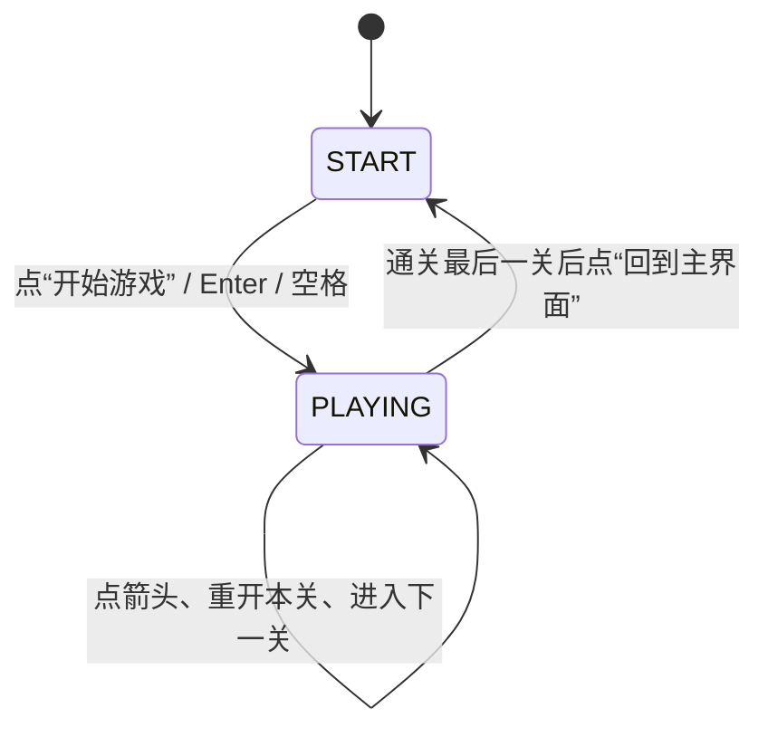
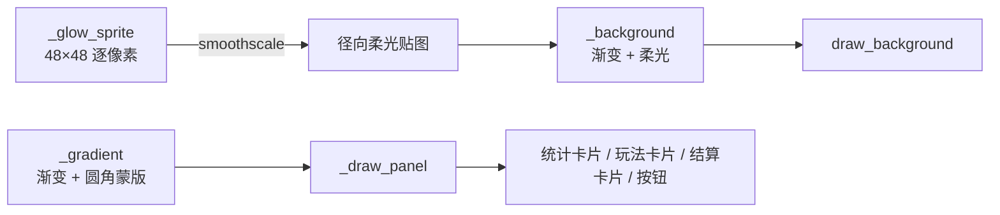

# 变更记录 05：开始界面与组件视觉设计

对应 `docs/agents/basic-info.md` 中 Priority 的**事项 5**。本轮补上此前一直空缺的**开始界面**，
并把界面里的按钮、卡片、统计块统一到一套**视觉基元**上（圆角渐变 + 描边 + 柔和投影），
顺带把整屏背景从纯色改成渐变 + 柔光。启动游戏后先看到开始界面，点击“开始游戏”才进入第 1 关；
通关最后一关后回到开始界面，因此它不只是启动画面。

## 变更内容

| 文件 | 修改 |
| --- | --- |
| `src/another_arrow_rt265/ui.py` | **新增** 视觉基元：`draw_background()` / `_background()`（渐变 + 柔光）、`_gradient()`（圆角渐变贴图）、`_draw_shadow()`、`_draw_glow()`、`_draw_panel()`、`_draw_arrow_glyph()`；**新增** `draw_start_screen()`、`start_button_rect()`、`rules_panel_rect()`；**重写** `draw_hud()`（三块统计卡片）、`draw_overlay()`（徽章 + 渐变卡片）；`_draw_button()` 拆成 `_draw_primary_button()` / `_draw_secondary_button()` |
| `src/another_arrow_rt265/game.py` | **新增** `Scene`（`START` / `PLAYING`）、`Game.start()` / `Game.return_to_start()`；点击、按键、`_run_primary_action()` 与 `_draw()` 都按当前画面分派 |
| `src/another_arrow_rt265/config.py` | `HUD_HEIGHT` 96 → 104；新增背景渐变 / 柔光配色与组件配色（`COLOR_BACKGROUND_*`、`COLOR_BACKGROUND_GLOW`、`GLOW_ALPHA`、`COLOR_SHADOW`、`COLOR_PANEL*`、`COLOR_BUTTON_*_HOVER`、`COLOR_PRIMARY`、`COLOR_ON_PRIMARY`、`COLOR_CARD_*`、`COLOR_BOARD_BORDER`），`COLOR_BACKGROUND` / `COLOR_BUTTON` / `COLOR_BUTTON_HOVER` / `COLOR_CARD` 由渐变对取代 |
| `src/another_arrow_rt265/board.py` | 棋盘底板加 2px 描边，避免深色棋盘在深色背景上糊成一片 |
| `tests/test_ui.py` | **新增** 6 项：统计卡片布局、开始界面按钮 / 卡片布局、开始界面绘制冒烟与整屏覆盖、背景渐变方向；更新最后一关的主按钮文案断言 |
| `tests/test_game.py` | **新增** 7 项：启动即开始界面、点击 / 回车开始游戏、开始界面忽略棋盘 / 信息栏点击与游戏内快捷键、通关最后一关回到开始界面、开始界面绘制；`game` fixture 改为“已离开开始界面” |
| `docs/agents/basic-info.md` | Priority 第 5 条标注“（已实现）” |

## 关键设计

### 画面切换放在 `Game`，不污染规则层

`Session` 继续只描述**关卡内**状态（进行中 / 通关 / 失败），开始界面属于“窗口在哪个画面”，
因此单独放在 `Game` 里：

```python
class Scene(Enum):
    START = "start"  # 开始界面：只响应“开始游戏”
    PLAYING = "playing"  # 游戏画面：棋盘 + 信息栏 + 结算卡片
```

这样拆分的好处是规则层测试完全不受影响：`tests/test_session.py` 里的通关 / 失败 / 重开
仍然直接操作 `Session`，而画面切换由 `tests/test_game.py` 在窗口级验证。



| 输入 | 开始界面 | 进行中 | 结算中 |
| --- | --- | --- | --- |
| 左键点棋盘 | 忽略 | 选中 / 清除 / 扣失误 | 忽略 |
| 左键点按钮 | 开始游戏 | 重新开始本关 | 下一关 / 重试本关 / 回到主界面 |
| `Enter` / 空格 | 开始游戏 | 忽略（避免误触丢进度） | 同主按钮 |
| `R` | 忽略 | 重新开始本关 | 重新开始本关 |
| `←` / `→` | 忽略 | 开发期切换关卡 | 同左 |
| `Esc` | 退出 | 退出 | 退出 |

### 视觉基元：一次写好组件外观，之后只调参数

界面里所有“块”现在都走同一套组件：**圆角渐变底板 + 描边 + 柔和投影**。

| 基元 | 作用 |
| --- | --- |
| `_gradient(size, top, bottom, radius)` | 竖直渐变，再用圆角矩形蒙版按 `BLEND_RGBA_MULT` 抠掉四角，得到带透明圆角的贴图 |
| `_draw_shadow(rect, radius, spread)` | 由外向内叠 4 层同心圆角矩形，外层几乎透明、内层最深，近似模糊投影 |
| `_draw_glow(rect, accent)` | 强调色外发光，用于主按钮的悬停态 |
| `_draw_panel(...)` | 上面三者的组合，是卡片 / 统计块 / 按钮的共同外观 |
| `draw_background(center)` | 整屏竖直渐变 + 一团径向柔光（棋盘 / 主按钮背后） |

因为 `pygame.draw` 是**直接写像素**而不是混合，叠层顺序被刻意排成“由外向内、由浅到深”，
这样每层只在自己没被覆盖的环带上可见，天然形成渐变。

所有贴图都用 `functools.lru_cache` 按参数缓存（`_gradient` / `_background` / `_glow_sprite`），
逐像素计算只发生在第一次；柔光先在 48×48 的画布上算完衰减再 `smoothscale` 放大，
一次 2304 个像素，之后每帧只是一次 `blit`。



### 开始界面布局

窗口从上到下依次是标题、四个方向的箭头圆牌、主按钮、玩法说明卡片：

| 区域 | 内容 |
| --- | --- |
| 标题（`y = 140`） | “一箭又一箭”（68px）+ 金色柔光垫底 |
| 副标题（`y = 212`） | `A N O T H E R   A R R O W`（字距拉开） |
| 箭头圆牌（`y = 272`） | `→ ↑ ← ↓` 四张 52×52 圆角牌，牌内金色箭头由三角箭头 + 短杆拼成 |
| 主按钮（心 `y = 368`） | 264×64 金色胶囊“开始游戏”，悬停时更亮并带一圈外发光 |
| 提示（`y = 428`） | `按 Enter / 空格 也可以开始` |
| 玩法卡片（`468 ~ 626`） | 标题“玩法” + 三条带金色圆点的规则 |
| 页脚（`y = 664`） | `共 3 关 · 每关 3 次失误机会`（取自 `Session`） |

装饰箭头最初只画了三角形，截图检查时发现和播放键（▶ ▲ ◀ ▼）几乎一样，于是改成
“三角箭头 + 短杆”的小箭头，和棋盘上的箭头形状语言保持一致。

### 信息栏：三块统计卡片 + 按钮

原来的信息栏是“小标题 + 一行文字 + 失误圆点”平铺，现在改成三块等高的统计卡片：

```
[ 关卡   1 / 3 ]  [ 剩余箭头  5 ]  …  [ 失误  ● ● ● ]  [ 重新开始 ]
```

- 卡片尺寸归一（高 72，`HUD_HEIGHT` 相应从 96 提到 104），关卡数值用金色、箭头数用主色，
  失误仍用圆点（亮红=剩余、暗色=已用）；
- `hud_chip_rects()` 是这三块卡片的**唯一几何来源**，失误卡片固定贴住“重新开始”按钮左侧，
  所以以后调按钮宽度不会让间距走样；
- 按钮分两种语义：主按钮填充强调色 + 深色文字（开始游戏、下一关、重试本关、回到主界面），
  次要按钮保持深色 + 亮色描边（重新开始）。

### 结算卡片

卡片改成渐变底 + 强调色描边，顶部加了一个圆形徽章：通关画勾、失败画叉，两个字形都用
`pygame.draw.lines` / `line` 直接画几何线段，不依赖字体里是否存在 `✓` / `✕`，
因此换字体也不会变成方块。

## 测试

本轮新增 13 项测试（共 78 项）：

| 测试 | 验收点 |
| --- | --- |
| `test_hud_chips_stay_inside_the_hud_and_clear_of_the_button` | 三块统计卡片在信息栏内、互不重叠、不压按钮与棋盘 |
| `test_start_button_is_centered_and_above_the_rules_panel` | 开始按钮水平居中、位于画面上中部、不压玩法卡片 |
| `test_start_screen_content_fits_inside_the_window` | 开始界面内容不越界 |
| `test_draw_start_screen_renders_without_error` | 开始界面绘制冒烟（含按钮悬停态） |
| `test_draw_start_screen_covers_the_whole_window` | 开始界面连背景一起画，四角不留未覆盖区域 |
| `test_draw_background_paints_a_top_to_bottom_gradient` | 背景自上而下由亮转暗 |
| `test_window_opens_on_the_start_screen` | 启动后停在开始界面，会话仍是第 1 关的初始状态 |
| `test_clicking_the_start_button_begins_the_game` | 窗口级：点击主按钮 → 进入游戏画面 |
| `test_enter_starts_the_game_from_the_start_screen` | 窗口级：`Enter` 等价于主按钮 |
| `test_start_screen_ignores_board_and_hud_clicks` | 开始界面点棋盘 / 信息栏按钮都不会改变状态 |
| `test_start_screen_ignores_in_game_shortcuts` | 开始界面按 `R`、`→` 不会重开或切关 |
| `test_clearing_the_last_level_returns_to_the_start_screen` | 通关最后一关 → 主按钮为“回到主界面” → 回到开始界面且会话重置 |
| `test_draw_renders_the_start_screen_frame` | 窗口级绘制冒烟覆盖开始界面 |

原有窗口级测试的 `game` fixture 改为“已调用 `Game.start()`”，因此 T01 ~ T06 的用例
仍然按原来的方式直接操作棋盘，不必每个用例都重复走一遍开始界面。

## 验证

```bash
uv run pytest -q              # 78 passed
uv run ruff check .           # All checks passed
uv run ruff format --check .  # 17 files already formatted
uv run ty check               # All checks passed
uv run python .preview/ui_frames.py   # 8 张界面图
uv run python .preview/run_demo.py    # dummy 驱动下跑真实主循环
```

`.preview/ui_frames.py` 现在多渲染 `00-start.png` 与 `00-start-hover.png`，共 8 张图逐张核对，
据此做了三处调整：

1. 装饰图形由三角形改成“三角箭头 + 短杆”的小箭头（原来像播放键）；
2. 棋盘底板加 2px 描边——6×6 关卡里深色棋盘和深色背景几乎连成一片；
3. 主按钮悬停光晕的 alpha 由 90 提到 120（原来看不出悬停与静止的区别）。

`.preview/run_demo.py` 在 dummy 驱动下先点“开始游戏”再点箭头、点“重新开始”，
确认“画面切换 → 点击 → 动画 → 重开”整条链路无异常，最后断言棋盘已恢复。

## 后续事项接口

- 事项 6（关卡预生成）：`Session` 的 `levels` 仍是可注入元组，随机生成的关卡直接替换即可，
  窗口与界面层不需要改动。
- 事项 7（辅助线）：棋盘绘制仍集中在 `Board.draw()`，辅助线适合做成
  `_draw_guidelines(surface)` 插在“格子”和“箭头”之间；`ui.py` 的 `_draw_dashed_line`
  同类实现在 `board.py` 里已有可复用版本（`_draw_dashed_line`）。
- 如果以后要加“关卡选择 / 设置”等更多画面，`Scene` 枚举就是挂载点；按钮布局沿用
  `xxx_rect()` 函数 + `_draw_primary_button()` 的组合即可。
