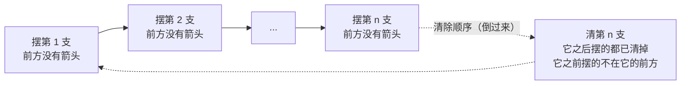
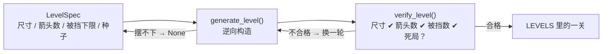

# 变更记录 11：关卡预生成与可通关性验证

对应 `docs/agents/basic-info.md` 中 Priority 第 7 条：**关卡预生成：可通过算法预生成关卡，减少人工设计量；
建议实现自动化验证关卡可通关性**。

这一轮把关卡数据从“手工画网格”改成“写一行规格、由算法生成”：新增模块
`generator.py`，用**逆向构造**生产必定可通关的关卡，再用**贪心求解器**独立验证一遍。
内置关卡随之从 3 关扩到 6 关——第 1 关（教程关）保持手写，其余 5 关全部由规格生成，
新增关卡从此只需要在 `LEVEL_SPECS` 里加一行。

## 变更内容

| 文件 | 修改 |
| --- | --- |
| `src/another_arrow_rt265/generator.py` | **新增**：`LevelSpec`（尺寸 / 箭头数 / 被挡下限 / 种子）、`generate_level()`（逆向构造）、`solve()` / `is_solvable()`（贪心求解）、`blocked_arrow_count()`、`verify_level()`（规格校验）、`generate_solvable_level()`（生成 + 验证，失败抛 `GenerationError`） |
| `src/another_arrow_rt265/levels.py` | 第 1 关改名为 `TUTORIAL_LEVEL` 并加 `TUTORIAL_LEVEL_SPEC`；新增 `LEVEL_SPECS`（5 行规格）与 `LEVELS = (TUTORIAL_LEVEL, *生成的关卡)`；删掉原来手写的第 2、3 关 |
| `tests/test_generator.py` | **新增** 58 项：生成属性测试 40 项（8 个种子 × 5 种尺寸/密度）、生成器行为 5 项、规格校验 5 项、求解与验证 6 项、内置关卡 2 项 |
| `.preview/print_levels.py` | **新增**：打印内置关卡的网格 / 难度统计 / 求解顺序，人工检查生成结果用（临时脚本） |
| `.preview/ui_frames.py` | 新增 `20-level-01` ~ `20-level-06` 六帧逐关截图 |
| `docs/agents/basic-info.md` | 事项 7 标注“（已实现）” |

## 关键设计

### 逆向构造：生成算法自带一份解

`generate_level()` 把棋盘格子打乱后逐个尝试摆放箭头，摆每一支时都要求**它的前进方向上还没有箭头**
（也就是“此刻它可以立刻飞出棋盘”）。方向的随机权重取它到边界的格数：箭头越朝棋盘内部，后面的箭头
越有机会落进它的前进方向把它挡住，关卡才有解谜的成分，而不是“每支箭头都能随手点掉”。

为什么这样摆出来的一定可通关？把摆放顺序**倒过来**清即可：



清第 k 支时，比它晚摆的箭头都已经清掉，而比它早摆的按构造不在它的前进方向上，所以它的前方必然畅通。
生成算法因此同时是**可通关性的构造性证明**，不需要额外搜索。

实测（`.preview/print_levels.py` 之外的一次性统计）：密度在 3/4 以下时逆向构造几乎不会失败，超过 3/4 后
失败率迅速上升，塞满整块棋盘（如 6x6 摆 36 支）基本摆不出来。所以 `generate_level()` 摆不下时返回 `None`，
由 `generate_solvable_level()` 换一轮随机顺序重试。

### 贪心求解：验证不依赖构造过程

`solve()` 是完全独立的第二道关：不看构造过程，对任意关卡反复挑一支“当前前方没有箭头”的箭头清掉，
全部清完就返回点击顺序，中途卡住就判定死局。它能当**判定器**用的理由是单调性——
清掉箭头只会减少阻挡，任何一支现在能清的箭头以后也一定能清，所以“随便挑哪一支”都不会错过解：

> 只要能通关，贪心就一定清得完；贪心清不完，就一定是死局。

（这也是原来 `tests/test_session.py` 里那段“反复点畅通箭头”的辅助函数能当通关测试用的原因，
本轮把它提炼成了正式的 `solve()`。）

### 生成 → 验证流水线



`verify_level()` 返回**所有**不合格原因（不是第一个），因此失败时能看到完整原因；
`generate_solvable_level()` 把它当门禁，最多尝试 200 轮，仍不合格就抛 `GenerationError` 而不是交出坏关卡。
`tests/test_generator.py::test_built_in_levels_match_their_specs` 再把 6 关逐一过一遍这道门禁：
**内置关卡的可通关性因此是每次跑测试都会被重新证明一遍的事实**。

### 规格即数据，教程关仍然手写

内置关卡 = 1 关手写教程 + 5 关生成：

| 关卡 | 尺寸 | 箭头 | 开局被挡 | 规格 |
| --- | --- | --- | --- | --- |
| 1（教程关） | 4x4 | 5 | 1 | 手写 `TUTORIAL_LEVEL` |
| 2 | 4x4 | 6 | 3 | `arrows=6, min_blocked=2, seed=0` |
| 3 | 5x5 | 10 | 6 | `arrows=10, min_blocked=4, seed=1` |
| 4 | 5x5 | 12 | 6 | `arrows=12, min_blocked=5, seed=2` |
| 5 | 6x6 | 16 | 8 | `arrows=16, min_blocked=7, seed=3` |
| 6 | 6x6 | 20 | 11 | `arrows=20, min_blocked=9, seed=4` |

第 2 关起的具体网格（`.preview/print_levels.py` 的输出）：

```
第 2 关 (4x4, 6)      第 3 关 (5x5, 10)   第 4 关 (5x5, 12)   第 5 关 (6x6, 16)   第 6 关 (6x6, 20)
.>>.                  .....               vv.vv               .<.^^<              ...>.>
.v..                  >...^               ..^<v               ...<^<              ..^.<>
.<^.                  ^..^.               >....               .v>.^.              .>>...
..<.                  .>...               >...v               ...v<.              ^.<^^<
                      >^^^^               <.>..               ^.<.v<              >.>^>.
                                                                ......              .<.^vv
```

**教程关保持手写**，因为它被两件事钉住了：一是教程的三步引导需要“既有一支前方畅通的箭头、
又有一支被挡住的箭头”（`min_blocked=1` 就是这条约束的书面化，`TUTORIAL_LEVEL_SPEC` 里写着）；
二是 `ui.tutorial_panel_rect()` 的位置假设“第 1 关棋盘 4x4、上沿在 174”，棋盘一变大提示条就得改版
（上一轮变更记录 10 已把这条交接给事项 12）。生成器本身已经支持任意尺寸，`generate_level(rows, cols, arrows)`
就是接口，等事项 12 要放开“棋盘大小、箭头数量”时直接接上即可。

### 与游戏规则对齐

求解器在纯 Python 上算，游戏逻辑在 `Board` 里——两套实现可能对“什么算被挡住”产生分歧。
`tests/test_generator.py` 用两个测试把两边钉在一起：

- `test_solver_order_is_accepted_by_the_board`：按求解器给出的顺序调用真实的 `Board.handle_click()`，
  每一步都必须返回 `CLEARED`，最后棋盘必须真的清空；
- `test_blocked_arrow_count_agrees_with_the_board`：`blocked_arrow_count()` 的结果必须等于
  `sum(1 for arrow in board if not board.is_path_clear(arrow))`。

## 测试

本轮新增 58 项（共 296 项）。

| 测试 | 验收点 |
| --- | --- |
| `test_generated_levels_always_match_the_spec_and_can_be_cleared`（40 个参数） | 8 个种子 × 5 种尺寸/密度：生成结果全部通过 `verify_level()`（尺寸、箭头数、被挡下限、无死局） |
| `test_generate_level_only_places_arrows_with_a_clear_path` | 连续生成 50 次，箭头数量准确、且每关都可通关（构造性保证的回归） |
| `test_generate_level_returns_none_when_it_cannot_place_them_all` | 1x1 摆不下 2 支时返回 `None`，而不是交出“少一支”的关卡 |
| `test_generation_is_reproducible` | 同一规格（含种子）永远得到同一关：内置关卡不会每次启动都变样 |
| `test_different_seeds_give_different_levels` | 换种子确实换关卡 |
| `test_generation_fails_loudly_when_the_spec_is_impossible` | 1x1 要求“有被挡的箭头”时抛 `GenerationError` |
| `test_invalid_specs_are_rejected`（5 个参数） | 尺寸为 0、箭头数为 0、箭头数超过格子数、被挡下限超过箭头数都抛 `ValueError` |
| `test_solver_reports_deadlocks` | 同一行两支箭头互相瞄准、十字互锁都被判定为死局 |
| `test_solver_finds_the_order_that_clears_the_chain` | 链式阻挡（必须先清挡路的那支）能给出正确顺序 |
| `test_solver_rejects_malformed_levels` | 空关卡、非矩形、未知符号都抛 `ValueError` |
| `test_solver_order_is_accepted_by_the_board` | 求解器结论与游戏规则一致（真实 `Board` 逐步验证） |
| `test_blocked_arrow_count_agrees_with_the_board` | 被挡箭头统计与 `Board.is_path_clear()` 一致 |
| `test_verify_level_reports_every_kind_of_problem` | 尺寸 / 箭头数量 / 被挡过少 / 死局四种问题各自报出对应原因 |
| `test_built_in_levels_match_their_specs` | 内置 6 关逐关通过验证，且总数 ≥ 3（题目要求） |
| `test_every_built_in_level_has_something_to_think_about` | 每关开局都至少有一支被挡住的箭头（不是“无脑点一遍”） |

原有测试基本无需改动：`test_session.py::test_built_in_levels_can_be_cleared` 等按 `LEVELS` 参数化的测试
自动覆盖了新增的 3 关；`test_board.py` 用 `LEVELS[2]` 的配色测试、`test_game.py` 的逐关入口测试也都是按关卡号取值，
换成生成关卡后依旧成立。

## 验证

```bash
uv run pytest -q                    # 296 passed
uv run ruff check .                 # All checks passed
uv run ruff format --check .        # 26 files already formatted
uv run ty check                     # All checks passed
uv run python .preview/print_levels.py  # 6 关网格 + 被挡统计 + 求解顺序 + 校验：通过
uv run python .preview/ui_frames.py     # 23 张图（新增 20-level-01 ~ 06）
uv run python .preview/run_demo.py      # 本关用时 0.615s，主循环冒烟通过
```

人工看图确认了 `20-level-02.png`（4x4、6 支：`(0,1)` 被 `(0,2)` 挡住，`(1,1)` 被 `(2,1)` 挡住，
开局 3 支可点）与 `20-level-06.png`（6x6、20 支，格子与彩色箭头排布正常、不越界、与信息栏和窗口边缘都不打架）。

## 后续事项接口

- 事项 11（辅助线）：辅助线要画的是“某支箭头前进方向上的第一支挡路箭头”，这正是 `Board.blocking_arrow()`
  在做的事；`generator._blocker()` 里的射线遍历是它的纯 Python 版本，如果以后要给“提示功能”算下一步该点哪支，
  可以直接用 `generator.solve()` 的返回值，不必再写一套判定。
- 事项 12（生成算法的配置自由度）：接口已经就位——`generate_level(rows, cols, arrows)` 与 `LevelSpec`
  都不关心内置关卡。要做“玩家自选棋盘大小 / 箭头数量”，只需把 UI 上的两个数字拼成 `LevelSpec`
  再交给 `generate_solvable_level()`；难度模型目前只有 `min_blocked`（开局被挡数量），
  想更细可以加“最少几步才能清完”“最长阻挡链长度”之类的指标，`solve()` 的返回值已经带了顺序信息。
- 关卡数量与难度曲线都写在 `levels.LEVEL_SPECS` 里，加一关就是加一行；`_pick_direction()` 的方向加权
  是唯一影响“手感”的启发式，换一种加权方式（例如按阻挡概率、按长链倾向）只改这一个函数。
- 打包（`uv run python -m nuitka --project`）不受影响：新模块只是包内的普通模块，
  不需要额外的 data 文件或插件选项。
