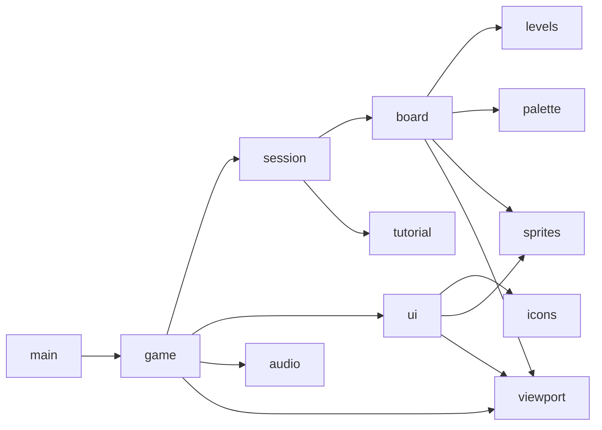

# Development Guide

面向开发者的上手文档：环境、结构、约定、检查与打包。

普通玩家请看 [Player Guide](../player/player-guide.md)；参与本仓库的 Agent 请先读 [`AGENTS.md`](../../AGENTS.md) 与 [`docs/agents/basic-info.md`](../agents/basic-info.md)。

## 环境准备

| 依赖 | 版本 | 说明 |
|--|--|--|
| Python | 3.13+ | 见 `pyproject.toml` 的 `requires-python`；uv 会自动装好解释器 |
| [uv](https://docs.astral.sh/uv/) | 最新 | 依赖与虚拟环境的唯一入口 |
| C 编译器 | — | 只有打包（Nuitka）需要，从源码运行不需要 |

`pygame-ce` 是唯一的运行时依赖；`ruff` 与 `ty` 也放在 `[project.dependencies]` 里，所以 `uv run ruff` / `uv run ty` 开箱可用。`pytest`、`nuitka`、`uv-build` 属于 `dev` 依赖组，`uv sync` 会一并安装。

## 快速开始

```bash
git clone https://github.com/rt265/another-arrow-rt265.git
cd another-arrow-rt265
uv sync
uv run another-arrow-rt265
```

你的设备将自动打开游戏窗口。

## 检查与测试

```bash
uv run pytest -q              # 测试用例
uv run ruff check .           # 静态检查
uv run ruff format --check .  # 格式检查
uv run ty check               # 类型检查
```

四条命令都必须干净。`tests/conftest.py` 把 SDL 切到 dummy 驱动并复位视口，所以测试不需要显示器；需要真实事件路径的测试可以自己建窗口，再用 `pygame.event.post()` 配合 `Game._handle_events()` 走分发。

测试应当断言**真实对象**（常量、几何函数、文件、渲染出的像素）。

## 打包与发布

使用 [Nuitka](https://nuitka.net/) 打包为独立可执行目录：

```bash
uv run python -m nuitka --project
```

- `--project` 会读 `pyproject.toml`，自动识别包名、`[project.scripts]` 的入口函数与 `[tool.nuitka]` 的打包策略，命令行不用重复写；
- 它依赖 `uv-build`（已在 dev 依赖里），缺了会直接退出；
- 首次打包需要 C 编译器并下载辅助工具（`assume-yes-for-downloads` 已开启），之后再打包复用编译缓存。

产物位置：

```text
build/nuitka/another-arrow-rt265.dist/
├─ another-arrow-rt265.exe   # 双击即可运行
├─ python313.dll             # 内嵌的 Python 运行时
└─ pygame/                   # pygame 扩展模块与 SDL2 等 DLL
```

发布：注意 `config.VERSION` 与 `pyproject.toml` 的 `version` 必须一致（`tests/test_config.py` 钉住）。

### CI/CD

| 工作流 | 触发 | 干什么 |
|--|--|--|
| `.github/workflows/test.yml` | 推送任意分支、PR、手动 | 跑 `pytest` / `ruff check` / `ruff format --check` / `ty check` 四条命令 |
| `.github/workflows/build.yml` | 推送 `main`、推送 `v*` 标签、手动 | 在 Windows 与 Linux 上各打一次包，压成 zip 上传为 Actions 产物；打上 tag `v*` 标签时发布到 GitHub Release |

- CI 用的就是 `uv run python -m nuitka --project` 这一条命令，包名 / 入口 / 打包策略仍只在 `pyproject.toml` 里写一次
- 发布附件名统一为 `another-arrow-<version tag>-<os>-<arch>.zip`（目前是 `-windows-x64` 与 `-linux-x64`；非标签构建把版本位换成短提交号），所以打标签前先确认 `config.VERSION` 与 `pyproject.toml` 的 `version` 一致、且标签名与版本号同形
- 打包后会做一次**冒烟**：产物要能在无显示器环境（SDL dummy 驱动）下启动并存活 8 秒，提前退出即判失败 —— 这能挡住“缺 DLL / 素材没进产物 / 入口写错”这类单元测试覆盖不到的问题

## 项目结构

```text
.
├─docs
│  ├─agents   # Agent 的工作状态与逐次改动记录
│  ├─dev      # 本文件
│  └─player   # 玩家指南
├─src
│  └─another_arrow_rt265
│     ├─assets  # 随程序分发的素材（字体、音频），必须待在包内
│     └─*.py   # 各个模块
├─tests        # pytest 测试，与源码模块基本一一对应
└─pyproject.toml # 项目情况
```

## 代码结构

数据从事件流向规则、再流向画面，反向不存在依赖——改规则不必碰界面：



| 模块 | 职责 |
|--|--|
| `main.py` | 入口：建窗口、起 `Game`、跑主循环 |
| `game.py` | `Game`：事件分发、画面切换（`Scene`）、动作表、音频接线、视口同步 |
| `session.py` | `Session`：关卡进度、失误、计时、通关 / 失败判定；不依赖 display，可直接测 |
| `board.py` | `Board`：格子几何、点击判定与碰撞、飞出动画、辅助线几何 |
| `generator.py` | 关卡生成与求解，纯算法，不依赖 pygame |
| `levels.py` | 关卡数据：第 1 关手写，其余由 `LEVEL_SPECS` 交给生成器 |
| `tutorial.py` | 第 1 关教程的状态机与文案 |
| `audio.py` | `Cue` + `Audio`：背景音乐与音效，含两个静音开关 |
| `ui.py` | 全部界面：菜单页、信息栏、结算卡片、教程提示、控件绘制与几何函数 |
| `viewport.py` | 设计尺寸 720×720 → 实际窗口的等比映射 |
| `sprites.py` | 抗锯齿贴图（超采样圆形 / 圆角矩形 / 圆点）与缓存 |
| `icons.py` | 代码绘制的矢量图标集 |
| `palette.py` | 箭头配色：主题色 → 圆片 / 描边 / 图形各状态 |
| `config.py` | 全局常量：窗口、布局、动画时长、配色、音量 |
| `resources.py` | 包内素材定位（字体 / 音频路径） |
| `direction.py` | 四个方向的向量与朝向换算 |

## 开发约定

### 设计尺寸与视口

布局常量一律按 720×720 的**绝对坐标**写，绘制时用 `viewport.s()` / `scaled()` 换算，
由 `ui.board_area()`、`Board.cell_rect()` 这类几何函数对外返回屏幕坐标。窗口缩放只改视口，
不改布局常量（见 `viewport.py` 的模块 docstring）。

### 界面几何只有一个来源

`ui.py` 的 `board_area()` / `hud_home_button_rect()` / `restart_button_rect()` /
`guide_toggle_rect()` / `overlay_button_rect()` / `menu_layout()` 等函数同时用于绘制与命中判定，
不要在 `game.py` 里另写一份坐标算术。

### 颜色与形状

- **一个颜色一个角色**：配色常量集中在 `config.py` 的“配色”等小节，界面里不要再写十六进制色值；
- 圆形、圆角矩形、圆点等形状必须走 `sprites.py`（4× 超采样 + `lru_cache`），不要直接
  `pygame.draw.circle`；轴对齐的直线（辅助线虚线、分隔线）例外，它们是精确像素且无锯齿；
- 箭头画多大只由 `config.ARROW_CHIP_RATIO` / `ARROW_GLYPH_RATIO` 决定，取尺寸请调用
  `Board.chip_radius()`，别再写 `cell.width * 比例`。

### 界面文案

界面**不写多余的说明文字**（详见 `AGENTS.md` 的 UI Copy Notice）：菜单页只放控件与事实性读数，
玩法由第 1 关的交互式教程承担。用户删掉的文案是有意为之，不要凭文档“加回去”。
产品规则由 `tests/test_ui.py::test_start_screen_keeps_no_rule_text` 与
`test_settings_page_keeps_no_explanatory_text` 钉住。

### 素材

素材放在**包内** `src/another_arrow_rt265/assets/`，用 `resources.font_path()` /
`sound_path()` 定位，绝不写相对路径。

- 字体：`assets/fonts/NotoSansCJKsc-{Light,Regular,Bold}.otf`，三个**静态字重**。不要引入可变字体（`-VF.otf`）：SDL_ttf 不认 `wght` 轴，只会画默认实例；
- 音频：`assets/sounds/<Cue 名>.mp3`，枚举值与文件主名一致；
- **不要**在 `[tool.nuitka]` 里写 `include-data-dir` / `include-data-files`：`--project` 已经用 `--include-package-data` 搬运包内文件，额外声明会被判为“多余的数据文件”而打包失败。

### 音频是旁白，不是规则

`Session` / `Board` 对音频一无所知，所有播放调用集中在 `game.py`。没有声卡或素材缺失时 `Audio` 静默降级（`play()` / `start_music()` 返回 `bool` 表示真的响了没有），因此 headless 与 CI 环境照常跑。

## 常见改动

### 加一关

在 `levels.py` 的 `LEVEL_SPECS` 里加一行 `LevelSpec(rows, cols, arrows, min_blocked, seed)`。关卡由 `generator.generate_solvable_level()` 逆向构造并校验，必须带 seed 才能保证确定性（`LEVELS` 在 import 时算好，同规格必须出同一关）。

方棋盘建议不超过 16×16：更大尺寸下生成密度与格子像素都会退化。`tests/test_session.py::test_built_in_levels_can_be_cleared` 会自动贪心求解每个内置关卡。

### 加一个界面

三步：在 `ui.py` 写一个 `MenuPage` → 在 `game.py` 的 `Scene` 加成员并补`_menu_page()` / `_draw()` 各一行 → 在 `Game._run_action()` 的动作表补一行。`MenuButton` 只声明动作名，这张表就是界面与逻辑之间唯一的接口（未注册的动作直接 `KeyError`）。

### 加一个音效

把 mp3 放进 `assets/sounds/`，在 `audio.Cue` 加一个成员（枚举值 = 文件主名），然后在 `game.py` 相应分支调用 `audio.play()`。规则层不要出现播放调用。

### 加一个图标

在 `icons.Icon` 加成员，并在 `draw_icon()` 里用几何图形画出来。`tests/test_icons.py` 对 `list(icons.Icon)` 参数化，加成员会自动被覆盖。

### 改配色 / 尺寸

箭头配色只动 `config.py` 的“彩色箭头”一节，`tests/test_board.py` 有像素级断言（会真的把棋盘画出来取色），不要只改常量就以为改好了。

布局常量只动“布局”“棋盘”两节，改完先跑 `tests/test_ui.py`，那里有整行宽度账与不遮格子的断言会先报警。

### 记录改动（对于 Agent）

每轮改动写一份 `docs/agents/change-log-NN-<主题>.md`，并同步更新 `docs/agents/basic-info.md` 的总状态（`AGENTS.md` 要求）。

## 调试与可视化

无显示器也能出图：设置 `SDL_VIDEODRIVER=dummy`，画到 `pygame.Surface` 上再 `pygame.image.save()`，然后人工看图。

| 脚本 | 用途 |
|--|--|
| `.preview/ui_frames.py` | 离屏截取各界面状态图（开始 / 游戏 / 结算 / 教程 / 辅助线 / 图标表） |
| `.preview/settings_frames.py` | 设置页开关的开 / 关 / 悬停三种状态 |
| `.preview/run_demo.py` | dummy 驱动下跑真实主循环，点一遍教程流程做冒烟 |
| `.preview/print_levels.py` | 打印生成关卡的网格、挡住统计与求解顺序 |
| `.preview/window_sizes.py` | 各窗口尺寸下的界面截图（检查缩放与留白） |
| `.preview/frame_time.py` | 稳态每帧耗时（改渲染后对比性能） |
| `.preview/font_check.py` | 并排渲染三个内置字重，肉眼确认字重生效 |
| `.preview/probe_resources.py` | standalone 探针，验证打包产物里的资源定位是真的 |

`.preview/` 已在 `.gitignore` 里，临时脚本随手放这里即可。

## 文档索引

| 文档 | 读者 |
|--|--|
| `docs/player/player-guide.md` | 玩家 |
| `docs/dev/development-guide.md` | 开发者（本文件） |
| `docs/agents/basic-info.md` | Agent：当前总体状态 |
| `docs/agents/change-log-NN-*.md` | Agent：每轮改动的细节 |
| `THIRD-PARTY.md` | 第三方素材（非代码资源）的许可声明 |

## 已知的坑

- 改 `config.py` 里的比例常量后做对照渲染，记得清 `lru_cache` 的贴图（例如`board_module._arrow_sprite.cache_clear()`），否则拿到的还是旧尺寸的图；
- 关卡手写容易出现“同行面对面互相瞄准”的死锁，改关卡数据后要正演一遍清空顺序；
- `pygame.draw` 直接写像素、不做混合，叠层顺序必须“由外向内、由浅到深”；
- 大表面的 `smoothscale` 会有通道取整误差（±2），小贴图精确，写像素断言时注意范围；
- Ruff 默认行宽 88，仓库暂未配置 `[tool.ruff]`，行为以默认规则为准。
